exclude: true
<style type="text/css">
code.r{
  font-size: 16px;
}
pre {
  font-size: 16px !important;
}
</style>
```{r setup, include=FALSE}
options(htmltools.dir.version = FALSE)
```
---
class: split-two
<link rel="stylesheet" href="https://cdnjs.cloudflare.com/ajax/libs/font-awesome/4.7.0/css/font-awesome.min.css">
.column.bg-main1[
.font2.comfortaa.coral[Com licença, você tem um momento para falar sobre o Github]<br><br>
.font_large.comfortaa[Integrado com o `r anicon::faa('r-project', animate='bounce', size=1,color='#ffff87')` com o Github `r anicon::faa('github', animate='float', size=1,color='#ffff87')`]
</br></br></br></br>
.font2.comfortaa[Steven Dutt-Ross <br><br> Professor da  .yellow[UNIRIO]<br>]
.font1.comfortaa[`r anicon::faa('link', animate='vertical', rtext='&nbsp;gae.uniriotec.br', color='white')` <br>]

.font_large.comfortaa[`r anicon::faa('github', animate='pulse', rtext=' DATAUNIRIO', color='white')` <br> `r anicon::faa('twitter', animate='pulse', rtext=' @RJengajado', color='#ffff87')`<br>`r anicon::faa('envelope', animate='pulse', rtext=' steven.ross@uniriotec.br', color='white')`<br>]
.font_large.comfortaa[GAE 2019, Rio de Janeiro</br>
30 Setembro, 2019]
</br></br></br>
.font_large[`r anicon::faa('link', animate='vertical', rtext='&nbsp;https://bit.ly/2nMINjf', color='white')`
]
]
.column.bg-main2.center[
</br></br>
.vmiddle[]
]


---
layout: false
class: bg-main1

.center[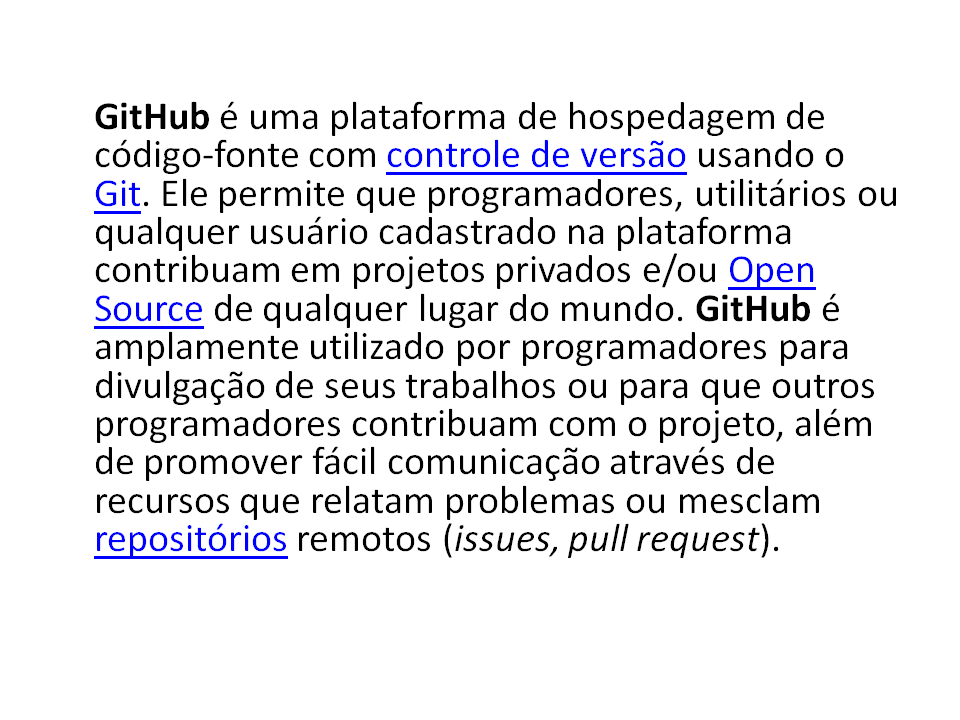]

---
layout: false
class: bg-main1

.center[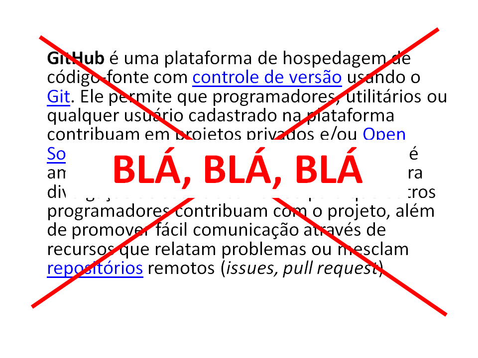]

---
layout: false
class: bg-main1

# .yellow[O que é] o Github?

# .yellow[Para que serve] o Github?

# .yellow[Como eu uso] o Github?

# .yellow[Referências] para o Github


.center[]

---
layout: false
class: bg-main1

</br>
## Para entender o GitHub, você deve primeiro .yellow[entender o Git].
 </br>
## O Git é um .yellow[sistema de controle de versão] de código aberto.

</br>
## Quando os desenvolvedores criam algo (um gráfico do R, por exemplo), .yellow[eles fazem constantes alterações no código], lançando novas versões desse mesmo gráfico.
</br>
## Os sistemas de controle de versão .yellow[mantêm essas revisões] corretas, .yellow[armazenando as modificações] em um .yellow[repositório central]. 

---
class: bg-main1

# .yellow[Referências] 

.center[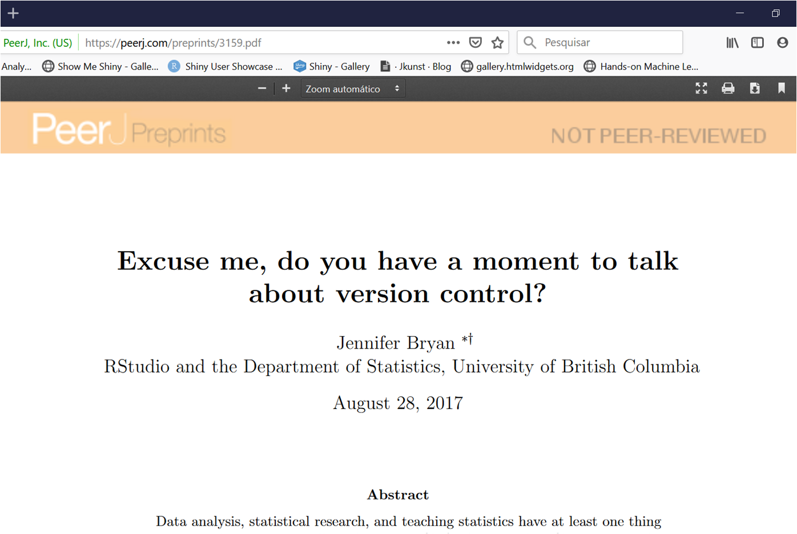]

.font_large[`r anicon::faa('link', animate='vertical', rtext='&nbsp;https://peerj.com/preprints/3159.pdf', color='white')`
]

---
class: bg-main1

# .yellow[Referências] 

.center[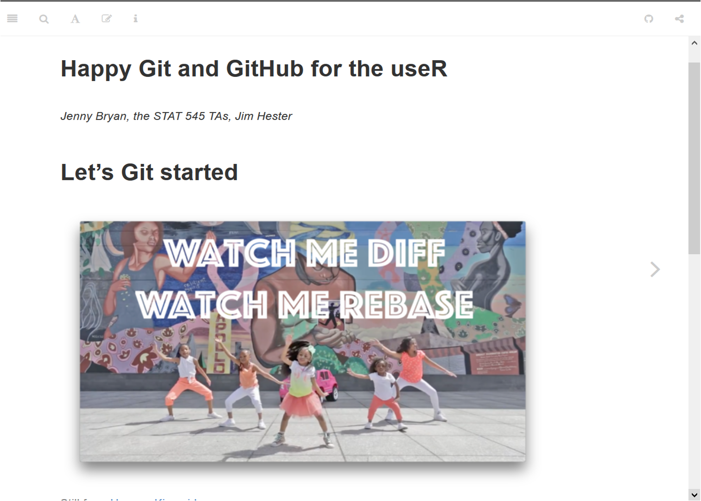]

.font_large[`r anicon::faa('link', animate='vertical', rtext='&nbsp;https://happygitwithr.com/', color='white')`
]


---
class: bg-main1

# 1. Controle de versão

.center[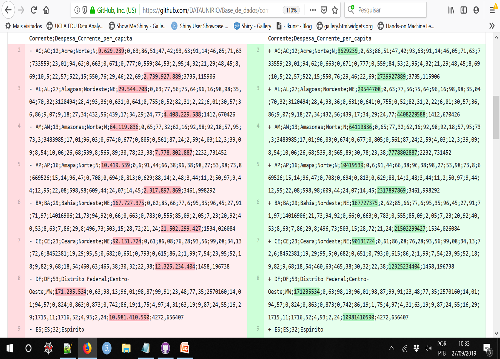]

---
class: bg-main1

# 1. Controle de versão

.center[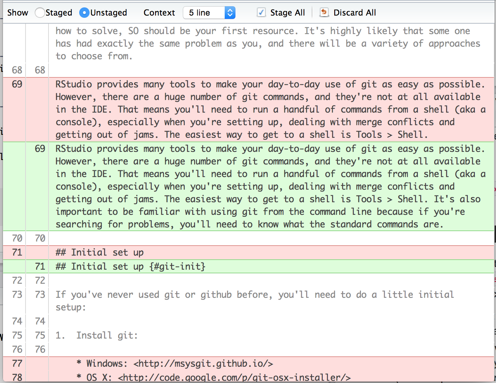]


---
class: bg-main1

# 2. Sincronizar o meu computador de casa com o do trabalho


.center[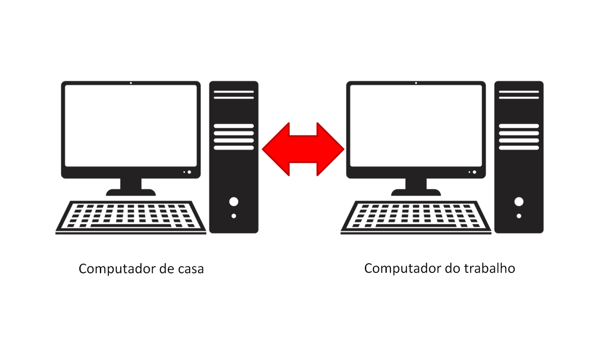]


---
class: bg-main1

# 3. Compartilhar o código

.center[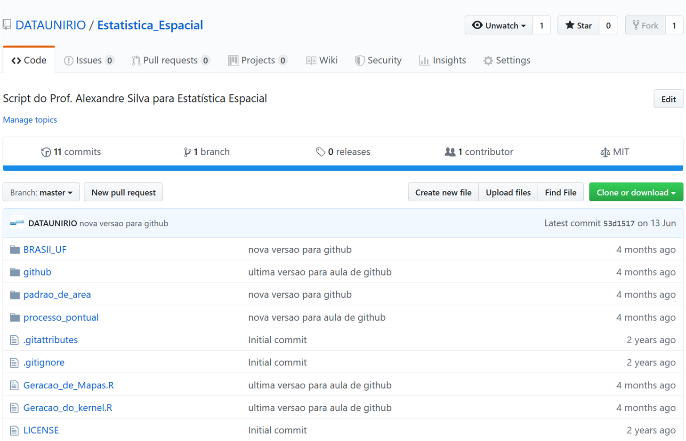]

---
class: bg-main1

# 3. Compartilhar o código

.center[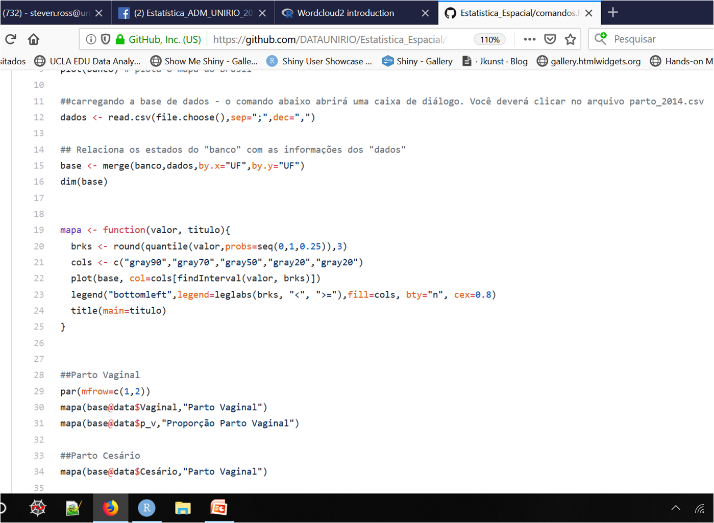]


---
class: bg-main1

# 3. Compartilhar o código
</br></br></br></br>
## source('https://raw.githubusercontent.com/DATAUNIRIO/Estatistica_Espacial/master/padrao_de_area/funcao_para_mapa.R')

---
class: bg-main1

# 3. Compartilhar o código
</br></br></br></br>
### library(RCurl)
</br>
### x <- getURL("https://raw.githubusercontent.com/DATAUNIRIO/Base_de_dados/master/Estados.csv")
</br>
### BaseUF <- read.csv(text=x, header=T, quote="", sep=";",dec = ",")
</br>
### remove(x)

---
class: bg-main1

# 4. Instalar pacotes de fora do cran

.center[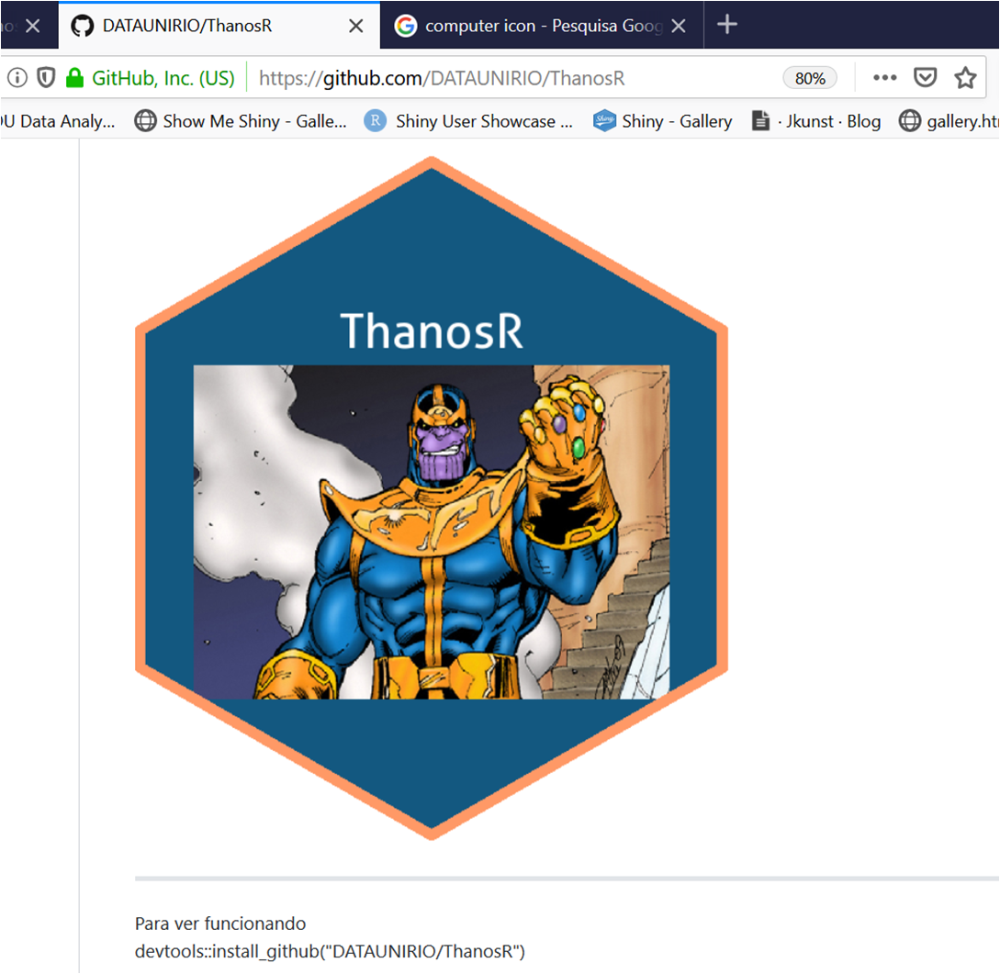]
Para instalar o ThanosR
devtools::install_github("DATAUNIRIO/ThanosR")

library(ThanosR)
data("mtcars")
dim(mtcars)
metade_da_base_de_dados<-estalar_dedos(mtcars)
dim(metade_da_base_de_dados)

---
class: bg-main1

# 5. Trabalhar em equipe
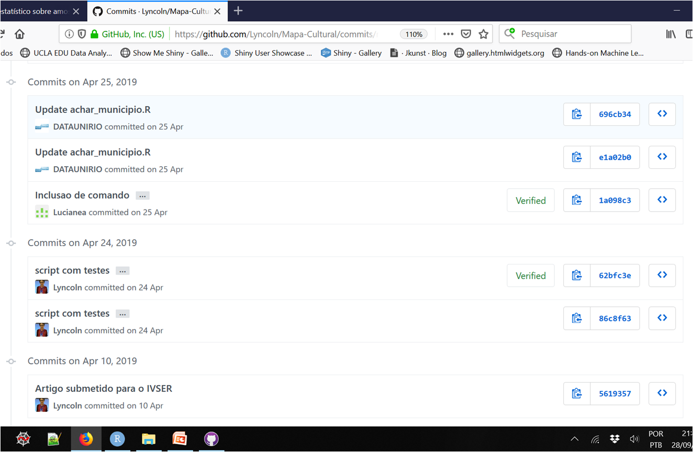


---
class: bg-main1

# 5. Trabalhar em equipe
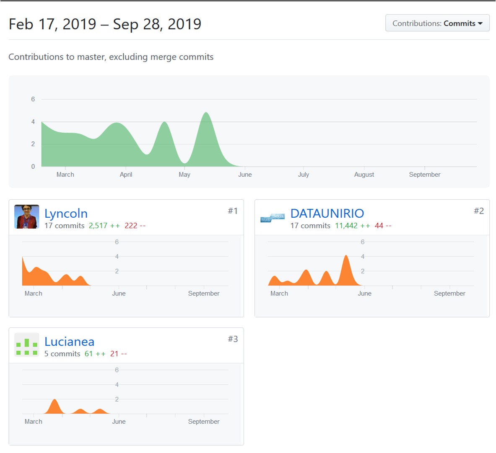

---
class: bg-main1

# 6. Hospedar o meu site

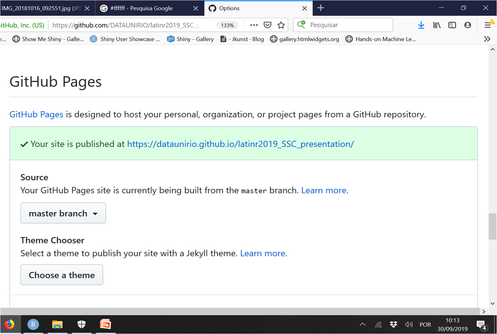
.font_large[`r anicon::faa('link', animate='vertical', rtext='&nbsp;https://dataunirio.github.io/latinr2019_SSC_presentation/#1', color='white')`
]


---
layout: false
class: bg-main1

# .yellow[O que é] o Github? `r icon::fa('check')`

# .yellow[Para que serve] o Github? `r icon::fa('check')``

# .yellow[Como eu uso] o Github? `r icon::fa('times')`

# .yellow[Referências] para o Github `r icon::fa('check')`


.center[]

---
class: bg-main1
# 3 Maneiras de usar o github: 
.yellow[prompt de comando]  </br>
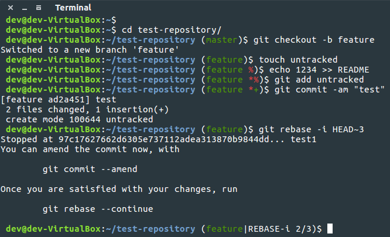


---
class: bg-main1

# 3 Maneiras de usar o github: 
.yellow[RStudio] </br>


---
class: bg-main1

# 3 Maneiras de usar o github: 
.yellow[Github Desktop] </br>


---
class: bg-main1

# Ainda quero falar sobre duas coisas:
</br>
</br>
# 1. Pull request
# 2. Issues

---
class: bg-main1

# Bitbucket
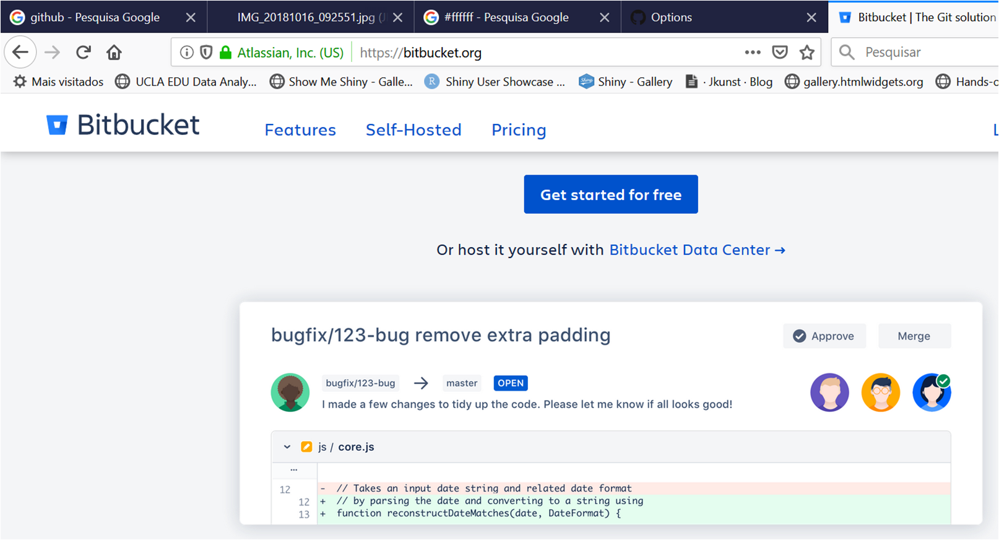
.font_large[`r anicon::faa('link', animate='vertical', rtext='&nbsp;https://bitbucket.org/', color='white')`
]

---
class: bg-main1 center
#Thanks!


